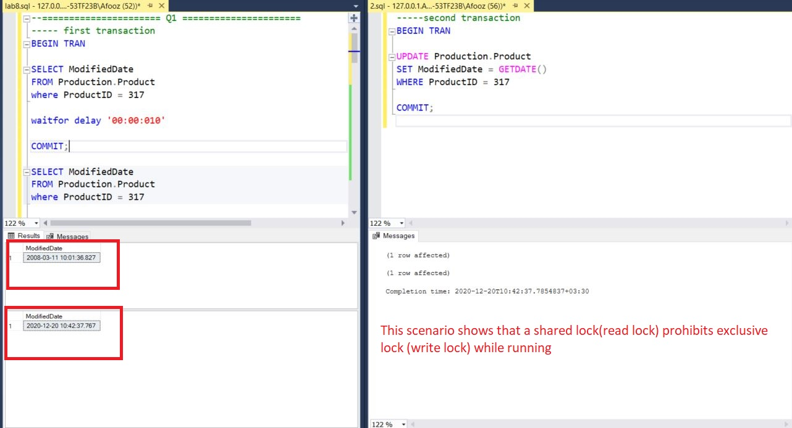
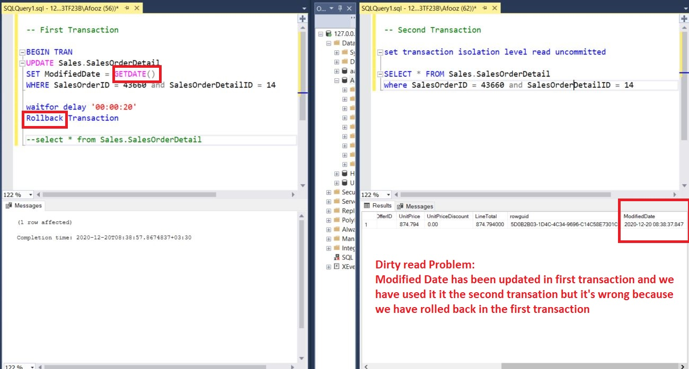
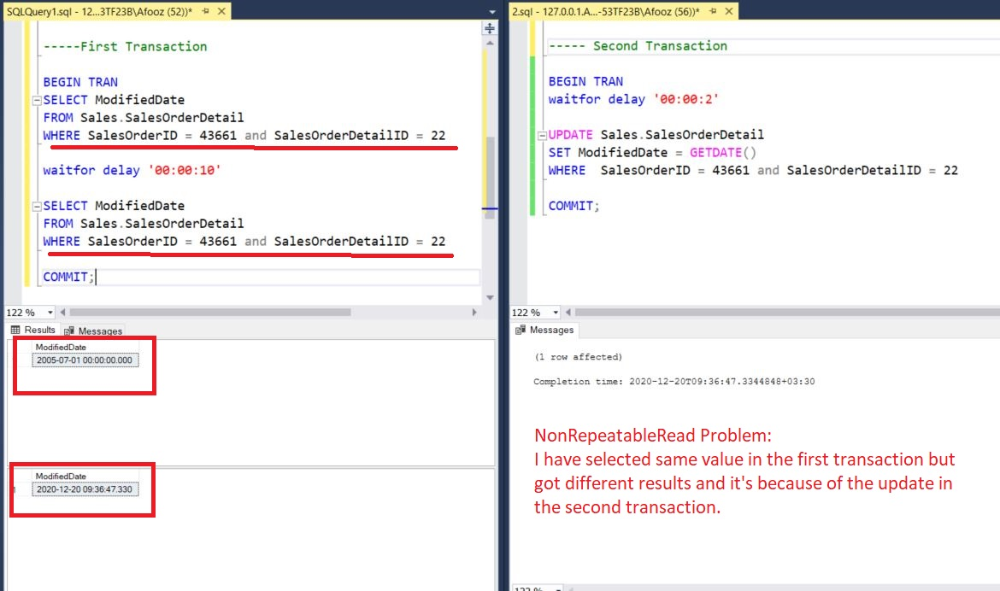

# DataBase-Lab
*My database laboratory homeworks and projects*
## LAB1:  
* Learned how to create tables, data insertion and making some queries . 
----
## LAB2:  
* Learned Case and aggregate functions and some queries on adventure works. 
----
## LAB3:  
* Learned about Logins, Roles and Permissions. 
----
## LAB4:  
* Learned about windowing, Grouping sets, rollup , cube .... 
----
## LAB8:  
* Part 1: Implementing a scenario to show that a shared lock prohibits exclusive lock. 

Part2 : A scenario for Dirty Read Problem 

Part3 : A scenario for Non repeatable Read Problem 

----

